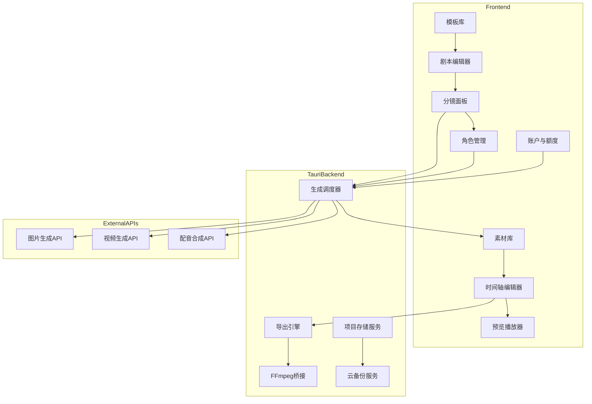
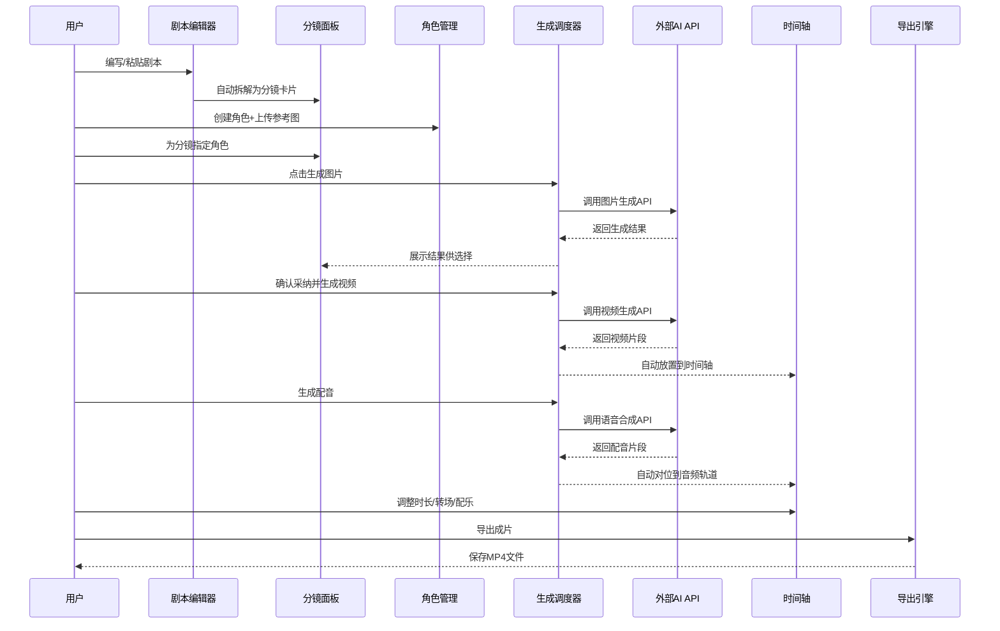
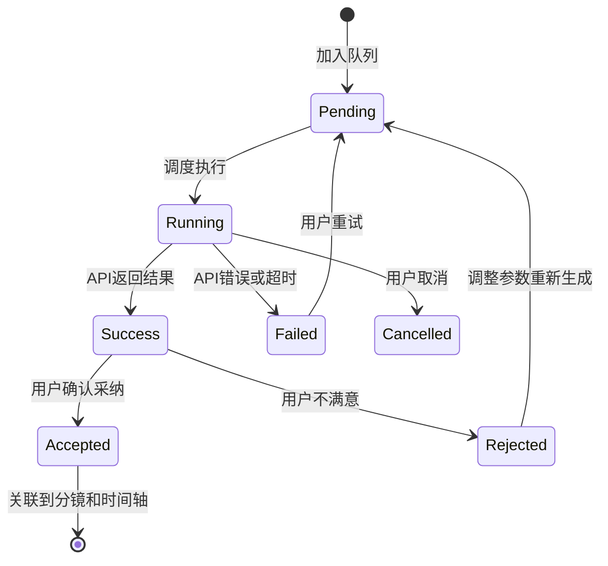
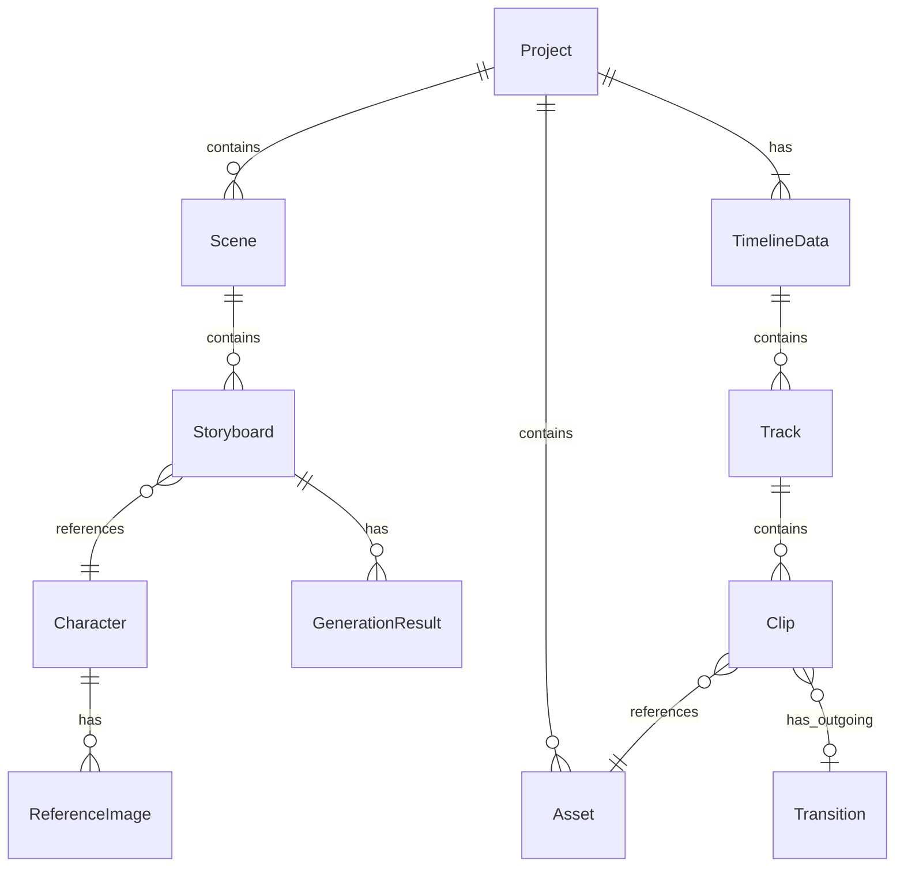

# 设计文档

## 概述

AI漫剧工作室是一款面向个人创作者的Tauri桌面应用，将AI漫剧制作从5-6个工具碎片化流程整合为一站式创作体验。用户从剧本编写开始，经分镜拆解、AI图片/视频生成、配音合成、时间轴编排，最终导出成片，全流程在一个应用内完成。

**目标用户**: 个人AI漫剧创作者（副业/自媒体），追求简单高效低成本。
**核心价值**: 消除工具切换，将10分钟漫剧制作时间从半天缩短到1-2小时。

### 目标
- 实现剧本→分镜→AI生图→AI生视频→配音→时间轴→导出的全流程闭环
- 多AI模型统一接入，用户自选模型
- 本地优先存储，支持离线编辑和手动云备份
- 免费基础功能 + 高级订阅 + 按量付费的混合商业模式

### 非目标
- AI模型训练/微调、真人视频剪辑、社交/社区功能、移动端App
- 企业级协作与权限管理、自动角色一致性检测（MVP手动标记）

## 边界承诺

### 本规格拥有
- 剧本编辑器与分镜拆解引擎、AI角色库管理、AI生成调度层、配音合成与自动对位
- 时间轴编辑器（多轨道编排、转场、预览）、视频导出（渲染+FFmpeg合成）
- 素材库管理（AI生成+本地导入）、基础模板库、用户账户与额度管理
- 项目数据本地持久化与手动云备份

### 边界外
- AI模型本身的训练/微调/部署、短视频平台发布流程、真人视频处理
- 云端自动同步（仅手动备份）、移动端适配

### 允许依赖
- 外部AI模型API（即梦/Seedance、Kling、MidJourney、讯飞、ElevenLabs等）
- Tauri 2.x框架及插件（fs、dialog、shell、http）
- Remotion视频渲染框架、本地FFmpeg便携版
- React 19 + TypeScript + TailwindCSS + shadcn/ui

### 重新验证触发
- GenerationService接口变更、项目文件格式变更、Remotion版本升级、时间轴数据模型变更

## 架构

### 架构模式与边界图



**架构集成**: 分层架构（前端UI层 → Tauri IPC层 → 后端服务层 → 外部API层）

### 技术栈

| 层 | 选择 / 版本 | 角色 | 备注 |
|---|---|---|---|
| 前端框架 | React 19 + TypeScript 5.x | UI渲染与交互 | Tauri WebView2 |
| UI组件 | TailwindCSS 4 + shadcn/ui | 样式与组件库 | 中文界面优先 |
| 状态管理 | Zustand 5.x | 全局状态管理 | 轻量，适合桌面应用 |
| 时间轴 | react-timeline-editor | 多轨道时间轴UI | 开源定制 |
| 视频渲染 | Remotion 4.x | 程序化视频生成与预览 | React生态原生 |
| 桌面框架 | Tauri 2.x | 桌面容器与原生API | Rust后端 |
| 视频导出 | FFmpeg 7.x 便携版 | 视频合成与转码 | Tauri侧shell调用 |
| 文件存储 | Tauri fs + IndexedDB | 项目持久化 | 元数据IDB，素材本地FS |

## 文件结构计划

```
src/
├── frontend/                    # React前端应用
│   ├── main.tsx                 # 应用入口
│   ├── App.tsx                  # 根组件与路由
│   ├── components/              # 通用UI组件
│   │   ├── ui/                  # shadcn/ui组件
│   │   └── layout/             # 布局组件
│   ├── features/               # 功能模块
│   │   ├── script/             # 剧本编辑器
│   │   │   ├── ScriptEditor.tsx        # 剧本文本编辑器
│   │   │   ├── StoryboardPanel.tsx     # 分镜卡片面板
│   │   │   ├── StoryboardCard.tsx      # 单个分镜卡片
│   │   │   ├── useScriptAutoSave.ts    # 自动保存Hook
│   │   │   └── types.ts
│   │   ├── character/          # 角色库管理
│   │   │   ├── CharacterManager.tsx
│   │   │   ├── CharacterForm.tsx
│   │   │   └── types.ts
│   │   ├── generation/         # AI生成调度
│   │   │   ├── GenerationPanel.tsx
│   │   │   ├── GenerationQueue.tsx
│   │   │   ├── ModelSelector.tsx
│   │   │   ├── useGenerationQueue.ts
│   │   │   └── types.ts
│   │   ├── voice/              # 配音合成
│   │   │   ├── VoicePanel.tsx
│   │   │   ├── VoiceSelector.tsx
│   │   │   └── types.ts
│   │   ├── timeline/           # 时间轴编辑
│   │   │   ├── TimelineEditor.tsx
│   │   │   ├── TrackRenderer.tsx
│   │   │   ├── TransitionEditor.tsx
│   │   │   ├── PreviewPlayer.tsx
│   │   │   └── types.ts
│   │   ├── assets/             # 素材库
│   │   │   ├── AssetLibrary.tsx
│   │   │   ├── AssetImporter.tsx
│   │   │   └── types.ts
│   │   ├── templates/          # 模板库
│   │   │   ├── TemplateGallery.tsx
│   │   │   └── types.ts
│   │   ├── account/            # 账户与额度
│   │   │   ├── AccountPanel.tsx
│   │   │   ├── QuotaDisplay.tsx
│   │   │   └── types.ts
│   │   └── export/             # 导出
│   │       ├── ExportDialog.tsx
│   │       ├── ExportProgress.tsx
│   │       └── types.ts
│   ├── stores/                 # Zustand全局状态
│   │   ├── projectStore.ts
│   │   ├── timelineStore.ts
│   │   ├── generationStore.ts
│   │   └── accountStore.ts
│   ├── services/               # 前端服务层
│   │   ├── generationService.ts       # 统一生成服务接口
│   │   ├── adapters/                  # AI模型适配器
│   │   │   ├── seedanceAdapter.ts
│   │   │   ├── klingAdapter.ts
│   │   │   ├── midjourneyAdapter.ts
│   │   │   ├── xfyunAdapter.ts
│   │   │   └── elevenLabsAdapter.ts
│   │   └── tauriBridge.ts            # Tauri IPC封装
│   └── hooks/
│       ├── useAutoSave.ts
│       ├── useNetworkStatus.ts
│       └── useQuotaGuard.ts
├── src-tauri/                   # Tauri Rust后端
│   ├── src/
│   │   ├── main.rs
│   │   ├── commands/
│   │   │   ├── project.rs      # 项目文件操作
│   │   │   ├── export.rs       # 导出命令
│   │   │   ├── backup.rs       # 云备份命令
│   │   │   └── system.rs       # 系统信息命令
│   │   └── services/
│   │       ├── ffmpeg_service.rs
│   │       └── storage_service.rs
│   └── Cargo.toml
└── remotion/                    # Remotion视频渲染
    ├── Root.tsx
    ├── MangaComposition.tsx
    └── render.ts
```

## 系统流程

### AI漫剧全流程



### 生成队列状态机



## 需求可追溯性

| 需求 | 摘要 | 组件 | 契约 |
|------|------|------|------|
| 1.1 | 剧本自动拆解分镜 | ScriptEditor, StoryboardPanel | GenerationService |
| 1.2 | 分镜卡片详情展示 | StoryboardCard | — |
| 1.3 | 修改分镜更新指令预览 | StoryboardCard | — |
| 1.4 | 空剧本提示 | ScriptEditor | — |
| 1.5 | 一键生成分镜 | StoryboardPanel, GenOrchestrator | GenerationService |
| 1.6 | 自动保存 | useScriptAutoSave | ProjectStore |
| 2.1 | 创建角色 | CharacterForm | — |
| 2.2 | 参考图锚点 | CharacterManager | GenerationService |
| 2.3 | 角色注入生成指令 | GenOrchestrator | GenerationService |
| 2.4 | 角色选择下拉 | StoryboardPanel | — |
| 2.5 | 角色不一致标记 | GenerationPanel | — |
| 2.6 | 角色修改标记分镜 | CharacterManager | — |
| 3.1-3.3 | 图片/视频/批量生成 | GenerationPanel, GenQueue | GenerationService |
| 3.4 | 队列进度展示 | GenerationQueue | — |
| 3.5 | 失败重试 | GenerationQueue | GenerationService |
| 3.6 | 重新生成+历史对比 | GenerationPanel | — |
| 3.7 | 模型选择 | ModelSelector | GenerationService |
| 3.8 | 采纳关联时间轴 | GenOrchestrator | TimelineStore |
| 4.1 | 音色列表试听 | VoiceSelector | GenerationService |
| 4.2-4.3 | 配音生成与对位 | VoicePanel, GenOrchestrator | GenerationService, TimelineStore |
| 4.4 | 空对话跳过 | VoicePanel | — |
| 4.5 | 时长调整配音适配 | TimelineEditor | — |
| 4.6 | 旁白独立轨道 | VoicePanel | TimelineStore |
| 5.1-5.7 | 时间轴编辑 | TimelineEditor | TimelineStore |
| 6.1-6.5 | 导出成片 | ExportDialog, ExportEngine | ExportService, FFmpegBridge |
| 7.1-7.4 | 模板库 | TemplateGallery | ProjectStore |
| 8.1-8.6 | 账户与额度 | AccountPanel, QuotaDisplay | AccountStore |
| 9.1-9.5 | 素材导入 | AssetLibrary, AssetImporter | TauriBridge |
| 10.1-10.2 | 离线编辑 | useNetworkStatus | — |
| 10.3-10.4 | 手动云备份 | AccountPanel | CloudBackup |
| 10.5 | 本地自动保存 | useAutoSave | ProjectStore |

## 组件与接口

### 组件概览

| 组件 | 域 | 意图 | 需求覆盖 | 关键依赖 | 契约 |
|------|---|------|----------|----------|------|
| ScriptEditor | 创作 | 剧本编辑与拆解 | 1.1,1.4,1.6 | ProjectStore(P0) | State |
| StoryboardPanel | 创作 | 分镜卡片管理 | 1.2,1.3,1.5,2.4 | ScriptEditor(P0),CharacterManager(P1) | State |
| CharacterManager | 创作 | 角色库CRUD | 2.1-2.6 | ProjectStore(P0) | State |
| GenerationOrchestrator | 生成 | 统一AI调度与队列 | 3.1-3.8,4.2-4.3 | Adapters(P0),AccountStore(P1),TimelineStore(P1) | Service,State |
| TimelineEditor | 编辑 | 多轨道时间轴 | 5.1-5.7 | TimelineStore(P0) | State |
| PreviewPlayer | 编辑 | 视频预览 | 5.3,5.5 | TimelineStore(P0) | — |
| ExportEngine | 导出 | 渲染与导出 | 6.1-6.5 | FFmpegBridge(P0),TimelineStore(P0) | Service |
| AssetLibrary | 管理 | 素材库 | 9.1-9.5 | TauriBridge(P0) | — |
| TemplateGallery | 管理 | 模板选择与保存 | 7.1-7.4 | ProjectStore(P0) | — |
| AccountPanel | 管理 | 账户与额度 | 8.1-8.6 | AccountStore(P0) | — |
| ProjectStore | 管理 | 项目数据持久化 | 1.6,10.5 | TauriBridge(P0) | State |
| CloudBackup | 管理 | 手动云备份 | 10.3,10.4 | TauriBridge(P0) | Service |

### GenerationOrchestrator（核心组件）

| 字段 | 详情 |
|------|------|
| 意图 | 统一AI生成调度，管理生成队列，结果分发 |
| 需求 | 3.1-3.8, 4.2-4.3 |

**职责与约束**
- 统一调度图片生成、视频生成、配音合成三种生成类型
- 管理生成队列（FIFO），支持批量提交、取消、重试
- 生成结果确认后自动关联到分镜并更新时间轴
- 额度守卫：执行前检查额度是否充足

**依赖**
- 入站: Adapters — 各AI模型API适配器 (P0), AccountStore — 额度查询 (P1), TimelineStore — 更新时间轴素材 (P1)
- 外部: 各AI模型API (P0)

**契约**: Service [✓] / State [✓]

##### 服务接口
```typescript
interface GenerationService {
  generateImage(params: ImageGenerationParams): Promise<Result<GenerationResult, GenerationError>>;
  generateVideo(params: VideoGenerationParams): Promise<Result<GenerationResult, GenerationError>>;
  generateVoice(params: VoiceGenerationParams): Promise<Result<VoiceResult, GenerationError>>;
  getAvailableModels(type: GenerationType): ModelInfo[];
}

interface GenerationOrchestrator {
  submitTask(task: GenerationTask): TaskId;
  cancelTask(id: TaskId): void;
  retryTask(id: TaskId): void;
  acceptResult(id: TaskId): void;
  rejectResult(id: TaskId, adjustedParams?: GenerationParams): void;
  getQueueStatus(): QueueStatus;
}
```

##### 状态管理
- 状态模型: Zustand generationStore（队列、任务状态、结果）
- 持久化: 队列不持久化（重启清空），已采纳结果持久化到项目文件
- 并发策略: 队列顺序执行，同一时刻只有一个任务调用API

**实现备注**
- 集成: 各Adapter实现GenerationService接口，Orchestrator通过Adapter调用
- 验证: 队列状态变更时触发UI更新
- 风险: API超时需设置合理超时（图片60s、视频300s、配音30s）

### ExportEngine

| 字段 | 详情 |
|------|------|
| 意图 | 视频渲染与导出，支持多格式/分辨率/帧率 |
| 需求 | 6.1-6.5 |

**契约**: Service [✓]

##### 服务接口
```typescript
interface ExportService {
  startExport(params: ExportParams): ExportTaskId;
  cancelExport(id: ExportTaskId): void;
  resumeExport(id: ExportTaskId): void;
  getExportProgress(id: ExportTaskId): ExportProgress;
}

interface ExportParams {
  resolution: "720p" | "1080p" | "4k";
  format: "mp4" | "webm";
  fps: 24 | 30 | 60;
  aspectRatio: "16:9" | "9:16";
  outputPath: string;
}
```

### ProjectStore

| 字段 | 详情 |
|------|------|
| 意图 | 项目数据本地持久化与自动保存 |
| 需求 | 1.6, 10.5 |

**契约**: State [✓]

##### 状态管理
- 状态模型: Zustand store（剧本、分镜、角色、时间轴、素材引用）
- 持久化: 通过Tauri fs写入本地JSON，30秒debounce自动保存
- 并发策略: 单用户单项目，无并发冲突

## 数据模型

### 领域模型



### 核心类型定义

```typescript
interface Project {
  id: string;
  name: string;
  createdAt: string;
  updatedAt: string;
  script: ScriptContent;
  scenes: Scene[];
  characters: Character[];
  assets: Asset[];
  timeline: TimelineData;
  templateId: string | null;
}

interface Scene {
  id: string;
  name: string;
  order: number;
  storyboards: Storyboard[];
}

interface Storyboard {
  id: string;
  sceneId: string;
  order: number;
  sceneDescription: string;
  characterIds: string[];
  dialogue: string;
  narration: string;
  cameraSuggestion: string;
  generationPrompt: string;
  selectedImageId: string | null;
  selectedVideoId: string | null;
  needsRegeneration: boolean;
}

interface Character {
  id: string;
  name: string;
  appearanceDescription: string;
  styleTags: string[];
  referenceImages: ReferenceImage[];
  voiceId: string | null;
}

interface Asset {
  id: string;
  type: "image" | "video" | "audio";
  source: "ai-generated" | "local-import";
  filePath: string;
  thumbnailPath: string | null;
  duration: number | null;
  modelUsed: string | null;
  generationParams: GenerationParams | null;
  createdAt: string;
}

interface TimelineData {
  tracks: Track[];
  durationMs: number;
}

interface Track {
  id: string;
  type: "video" | "voice" | "music";
  clips: Clip[];
}

interface Clip {
  id: string;
  assetId: string;
  trackId: string;
  startMs: number;
  endMs: number;
  volume: number;
  fadeInMs: number;
  fadeOutMs: number;
  transitionId: string | null;
}

interface GenerationTask {
  id: string;
  type: "image" | "video" | "voice";
  storyboardId: string;
  modelId: string;
  params: GenerationParams;
  status: "pending" | "running" | "success" | "failed" | "cancelled";
  result: GenerationResult | null;
  error: string | null;
  history: GenerationResult[];
}
```

### 物理存储模型
- 项目文件: 本地JSON文件（`~/.manga-studio/projects/{id}/project.json`）
- 素材文件: 本地目录（`~/.manga-studio/projects/{id}/assets/`）
- 元数据缓存: IndexedDB（项目列表、最近打开、用户偏好）
- 云备份: 整个项目目录打包上传

## 错误处理

### 错误策略

| 错误类型 | 处理方式 | 用户可见行为 |
|----------|----------|-------------|
| AI API超时 | 标记任务失败，允许重试 | 队列中显示"超时"状态+重试按钮 |
| AI API错误 | 记录错误信息，标记失败 | 显示错误原因+重试按钮 |
| 额度不足 | 阻止任务提交 | 提示购买额度或升级订阅 |
| 网络断开 | 禁用AI功能，允许离线编辑 | 顶部网络状态提示条 |
| 文件读写失败 | 重试3次后提示 | 提示检查磁盘空间和权限 |
| FFmpeg导出失败 | 保留已渲染帧，允许续传 | 显示断点续传按钮 |
| 不支持的素材格式 | 拒绝导入 | 提示支持的格式列表 |

### 错误恢复
- 自动保存: 30秒debounce，异常退出后恢复最近自动保存点
- 生成结果: 历史结果保留，可回退到任意历史版本
- 导出断点: 已渲染帧序列保留在临时目录，支持续传

## 测试策略

### 单元测试
- GenerationOrchestrator队列状态机转换逻辑
- 剧本→分镜拆解算法（场景识别、对话提取）
- 角色参考图注入生成指令的参数组装
- 额度守卫逻辑（免费/订阅用户限制判断）
- 时间轴片段重叠/间隙检测

### 集成测试
- GenerationService Adapter调用链（mock API响应）
- 生成结果→时间轴素材自动关联流程
- 配音生成→自动对位时间轴流程
- 项目数据→Tauri fs→本地文件读写流程
- ExportEngine→FFmpeg渲染导出流程

### E2E测试
- 完整创作流程：新建项目→写剧本→拆分镜→生成图片→生成视频→配音→时间轴调整→导出MP4
- 素材导入→时间轴编排→导出流程
- 离线场景：断网→编辑剧本→恢复网络→生成图片
- 模板使用：选择模板→修改剧本→生成→导出

### 性能测试
- 50+分镜批量生成队列吞吐量
- 时间轴100+片段拖拽流畅度
- 10分钟1080P视频导出耗时
